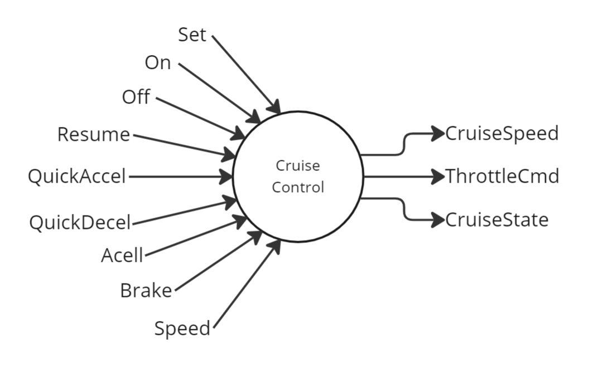

# Cruise Control System

This repository contains the Esterel implementation for a simple cruise control system for a vehicle.



## Overview

The system is designed to maintain a certain vehicle speed set by the driver. This is achieved by adjusting the throttle position to match the set cruising speed with the actual vehicle speed. The program is divided into several modules, each of which performs a specific function:

- **CruiseControl**: The main module. It runs several sub-modules concurrently and controls the inputs/outputs of the cruise control system.
- **CruiseStateController**: Manages the state of the cruise control system, including transitioning between OFF, ON, STANDBY, and DISABLE states.
- **CruiseSpeedController**: Manages the cruising speed of the vehicle. The cruising speed can be set or adjusted up or down within a specified speed limit.
- **ThrottleController**: Regulates the throttle command based on the current cruise state and speed, accelerator input, and the current speed of the vehicle.
- **BrakeCheck**: Checks if the brake is pressed.
- **AccelCheck**: Checks if the accelerator is pressed.
- **SpeedLimitCheck**: Checks if the vehicle's speed is within a specified speed limit.

## Usage

To use this program, you need an Esterel compiler like Esterel Studio. After installation, you can run the program as follows:

1. Clone this repository:
   ```
   git clone https://github.com/ThiagoSoutoGit/CruiseControl/tree/main/CruiseControl
   ```
2. Navigate to the repository folder:
   ```
   cd CruiseControl
   ```
3. Compile and run the program with your Esterel compiler.

## Contributing

Pull requests are welcome. For major changes, please open an issue first to discuss what you would like to change.
